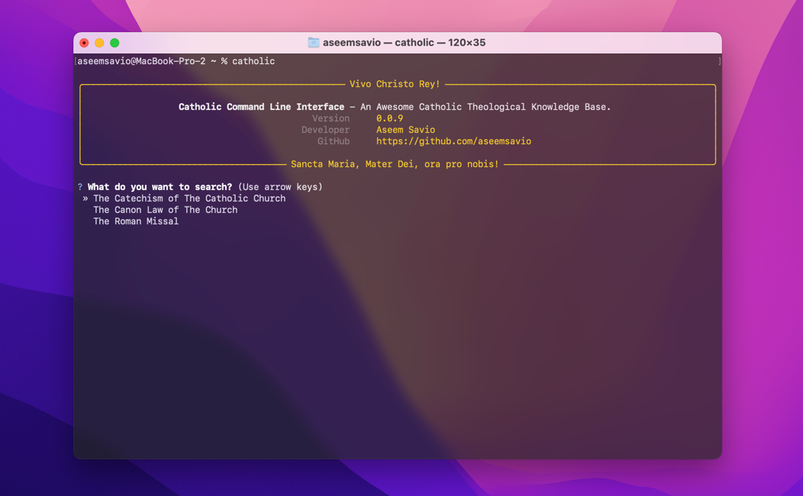
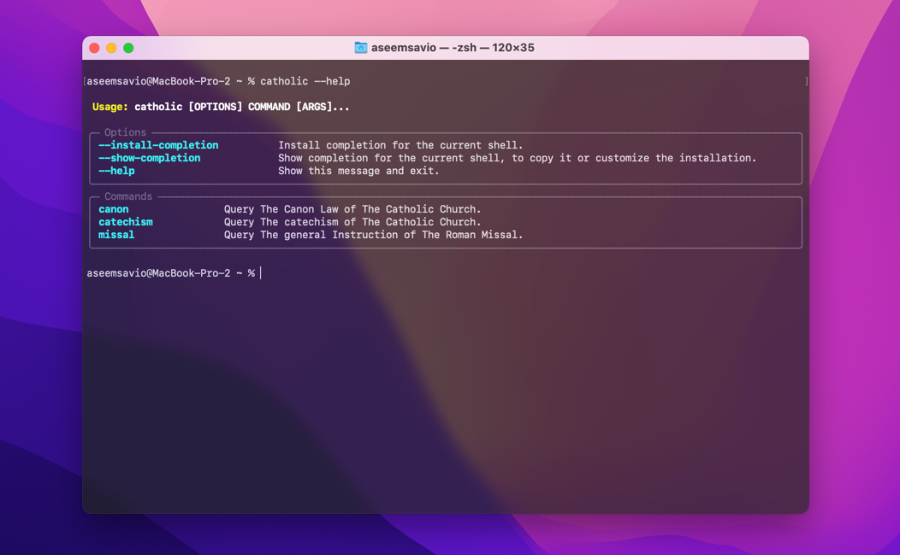

# 🇻🇦catholic-cli

[](https://github.com/aseemsavio/catholic-cli)

The `catholic-cli` is an awesome Catholic Theological knowledge base.
The tool currently has the following functionalities:

1. Access information from **The Catechism** of The Catholic Church,
2. Access information from **The Roman Missal**,
3. Access Information from **The Canon Law** of The Catholic Church

### Installation

The prerequisite is to have Python 3 installed on your computer.

Type the following command on your terminal to install this.

```commandline
pip3 install catholic-cli
```

To do a clean update

```commandline
pip3 uninstall catholic-cli
pip3 install catholic-cli
```

### How to Interact with Catholic CLI

Non advanced users can simply type "catholic" in their terminal to start the application.
Then you can use the arrow keys on your keyboard to select the different options.



More advanced users can use the command line tool similar to any other CLI.

Typing `--help` at any level displays commands and arguments you can provide to the command at that level.



### General Syntax

The general syntax for using the tool is as follows.

```
<command> <sub-command> <options>
```

The default command in this CLI is `catholic`. All the sub commands are grouped under it.

The allowed sub-commands are:

1. `catechism`
2. `missal`
3. `canon`

The options currently supported by the `catholic-cli` are:

|     | Option        | Short Form | Data Type | Description                             | Commands/sub-commands that allow this option | Examples                                                                  |
|-----|---------------|------------|-----------|-----------------------------------------|----------------------------------------------|---------------------------------------------------------------------------|
| 1   | `--paragraph` | `-p`       | INT, TEXT | Displays Paragraph(s) with the given ID | `catechism`<br/>`canon`<br/>`missal`         | `--paragraph 10`<br/>`-p 10`<br/> `-p 1-5`<br/>`-p 1,2`<br/> `-p 1,2,4-5` |
| 2   | `--search`    | `-s`       | TEXT      | Search for the given string             | `catechism`<br/>`canon`<br/>`missal`         | `--search "Christ"`<br/>`-s "eucharist"`<br/>`-s "The Church"`            |
| 3   | `--help`      |            | BOOLEAN   | Get help text                           | `catholic`                                   | `--help`                                                                  |
| 4   | `--version`   |            | BOOLEAN   | Displays the version of this CLI        | `catholic`                                   | `--version`                                                               |

Feel free to send PRs my way if you're willing to contribute to this project 🍻
